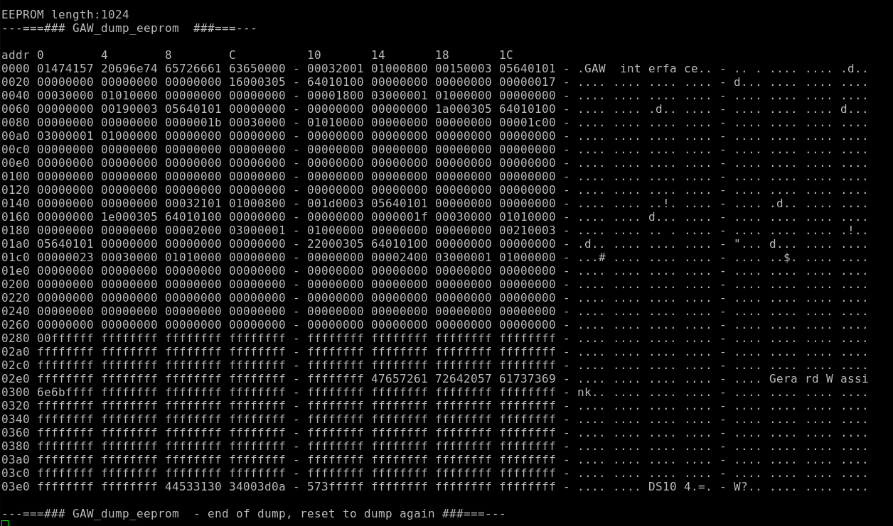

# GAW_dump_eeprom
 Dump EEPROM contents

## format:

aaaa hhhhhhhh hhhhhhhh hhhhhhhh - hhhhhhhh hhhhhhhh hhhhhhhh hhhhhhhh - cccc cccc cccc cccc - cccc cccc cccc cccc 

where:
- aaaa = hex address
- hhhhhhhh = hex characters from eeprom contents
- cccc = if printable: ascii characters, else decimal point

See picture:

